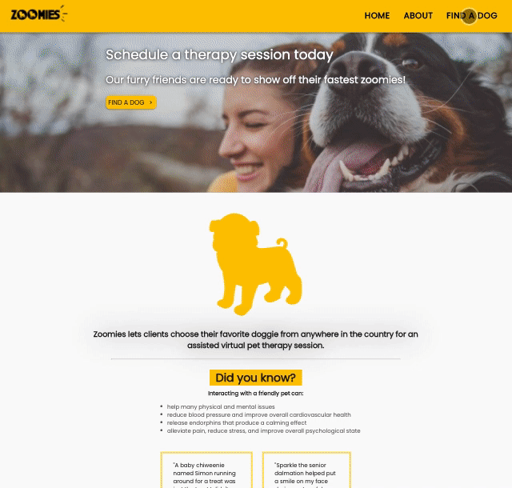

# Zoomies (Under Construction)
A full stack Node.js and React web app for scheduling zoom pet therapy sessions with a doggie of your choice!

## Technologies Used
- React(hooks)
- Node.js
- Express
- React Router
- Material UI
- Webpack
- CSS3
- HTML5
- Babel
- Petfinder API
- Axios

## Live Demo
Try the app live [here!](https://zoomies-pet-therapy.arlettepineda.com/)

## Features
- Users can view list of all dogs
- Users can filter by breed, age, and size
- Users can page through results

## Preview



### Development
- Node.js 10 or higher
- NPM 6 or higher
- Express 4 or higher

### Getting Started

1. Clone the repository.
  ```
    git clone https://github.com/arlette-pineda/zoomies
  ```
2. Change directories to folder.
  ```
    cd zoomies
  ```
3. Install dependencies with NPM.
  ```
     npm install
  ```
5. Request API Key and Secret.
    * Go to https://www.petfinder.com/developers/
    * Click on GET AN API KEY button and follow instructions

6. You many now start the project. It can be viewed by going to http://localhost:3000 in your browser. 
  ```javascript
    npm run dev 
  ```

